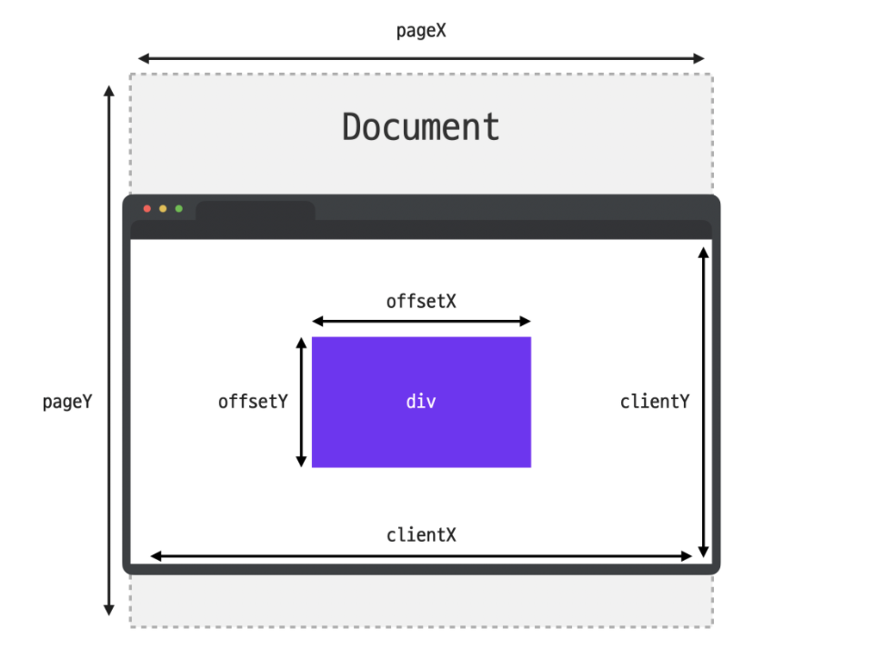

## 마우스 이벤트

### clientX, clientY
<b>client</b> 프로퍼티는 말 그대로 클라이언트 영역 내에서 마우스의 좌표 정보를 담고있다.클라이언트 영역이란 이벤트가 발생한 순간에 브라우저가 콘텐츠를 표시할 수 있는 영역을 뜻한다.

<b>clientX</b> : 브라우저가 표시하는 화면 내에서 마우스의 X좌표 위치를 담고 있다
<b>clientY</b> : 브라우저가 표시하는 화면 내에서 마우스의 Y좌표 위치를 담고 있다

client 값은 그 순간 보여지는 화면을 기준으로 계산하기 때문에 스크롤 위치와는 무관하게 항상 보여지는 화면의 좌측 상단의 모서리 위치를 (0, 0)으로 계산

### offsetX, offsetY
<b>offset</b> 프로퍼티는 이벤트가 발생한 <b>target</b>이 기준

<b>offsetX</b> : 이벤트가 발생한 <b>target</b> 내에서 마우스의 X좌표 위치를 담는다
<b>offsetY</b> : 이벤트가 발생한 <b>target</b> 내에서 마우스의 Y좌표 위치를 담는다

offset 값도 이벤트가 발생한 대상을 기준으로 계산하기 때문에 스크롤 위치와는 무관하게 항상 대상의 좌측 상단의 모서리 위치를 (0, 0)으로 계산

### pageX, pageY
<b>page</b> 프로퍼티는 전체 문서를 기준으로 마우스 좌표 정보를 담는다. 그렇기 때문에 스크롤로 인해서 보이지 않게된 화면의 영역까지 포함해서 측정한다는 점이 앞의 두 프로퍼티와의 차이점 이다.

<b>pageX</b> : 전체 문서 내에서 마우스의 X좌표 위치를 담는다.
<b>pageY</b> : 전체 문서 내에서 마우스의 Y좌표 위치를 담는다다.

자칫 client 값과 혼동하기 쉬우니 잘 구분해 두시는 것이 좋다.
   

## MouseEvent.button

| 값 | 내용 | 
|---|:---:|
|0|마우스 왼쪽 버튼
|1|마우스 휠
|2|마우스 오른쪽 버튼
|3|X1 (일반적으로 브라우저 뒤로 가기 버튼)
|4|X2 (일반적으로 브라우저 앞으로 가기 버튼)

<code>mouseenter, mouseleave, mouseover, mouseout, mousemove</code> 처럼 마우스 이동과 관련된 이벤트에서는 이 값이 null이나 undefined가 아니라 <b>0</b>

## MouseEvent.type
| 이벤트 타입 | 설명 | 
|---|:---:|
|mousedown|마우스 버튼을 누르는 순간
|mouseup|마우스 버튼을 눌렀다 떼는 순간
|click|왼쪽 버튼을 클릭한 순간
|dblclick|왼쪽 버튼을 빠르게 두 번 클릭한 순간
|contextmenu|오른쪽 버튼을 클릭한 순간
|mousemove|마우스를 움직이는 순간
|mouseover|마우스 포인터가 요소 위로 올라온 순간
|mouseout|마우스 포인터가 요소에서 벗어나는 순간
|mouseenter|마우스 포인터가 요소 위로 올라온 순간 (버블링이 일어나지 않음)
|mouseleave|마우스 포인터가 요소에서 벗어나는 순간 (버블링이 일어나지 않음)

## MouseEvent.위치프로퍼티
마우스 이벤트 객체에는 마우스 포인터의 위치와 관련된 다양한 프로퍼티들이 있고, 주로 아래와 같은 프로퍼티들이 자주 사용
| 프로퍼티 | 설명 | 
|---|:---:|
|<code>clientX, clientY	</code>|마우스 포인터의 브라우저 표시 영역에서의 위치
|<code>pageX, pageY	</code>|마우스 커서의 문서 영역에서의 위치
|<code>offsetX, offsetY</code>|마우스 포인터의 이벤트 발생한 요소에서의 위치
|<code>screenX, screenY	</code>|마우스 포인터의 모니터 화면 영역에서의 위치

## MouseEvent.relatedTarget
<code>mouseenter, mouseleave, mouseover, mouseout</code> 이벤트에는 <code>relatedTarget</code>이라는 프로퍼티가 존재

target 프로퍼티가 이벤트가 발생한 요소를 담고 있다면, relatedTarget 프로퍼티는 이벤트가 발생하기 직전(또는 직후)에 마우스가 위치해 있던 요소를 담고있음

비슷하지만 서로 다른 두 프로퍼티를 잘 구분해서 기억해둘것.

## KeyboardEvent.type
| 이벤트 타입 | 설명 | 
|---|:---:|
|keydown|키보드의 버튼을 누르는 순간
|keypress|키보드의 버튼을 누르는 순간 ('a', '5' 등 출력이 가능한 키에서만 동작하며, Shift, Esc 등의 키에는 반응하지 않음)
|keyup|키보드의 버튼을 눌렀다 떼는 순간

## KeyboardEvent.key vs KeyboardEvent.code
키보드 이벤트 객체에는 <code>key</code>와 <code>code</code> 프로퍼티가 자주 사용s

<code>key</code>는 사용자가 누른 키가 가지고 있는 값을 나타내고 <code>code</code> 누른 키의 물리적인 위치를 나타낸다는 점! 잘 구분해서 기억

## input태그 다루기
input 태그는 말 그대로 입력의 역할을 하는 태그. 타입에 따라 조금씩 차이가 있을 수 있지만, input 태그를 다룰 때는 아래와 같은 이벤트 타입들이 활용될 수 있다.

| 이벤트 타입 | 설명 | 
|---|:---:|
|focusin|요소에 포커스가 되는 순간
|focusout|요소에 포커스가 빠져나가는 순간
|focus|요소에 포커스가 되는 순간 (버블링이 일어나지 않음)
|blur|요소에 포커스가 빠져나가는 순간 (버블링이 일어나지 않음)
|change|입력된 값이 바뀌는 순간
|input|값이 입력되는 순간
|select|입력 양식의 하나가 선택되는 순간
|submit|폼을 전송하는 순간

## 스크롤 이벤트
scroll 이벤트는 보통 <code>window</code> 객체에 이벤트 핸들러를 등록하고 window 객체의 프로퍼티와 함께 자주 활용되는데요.

특히 <code>scrollY</code> 프로퍼티를 활용하면 스크롤된 특정한 위치를 기준으로 이벤트 핸들러가 동작하게 하거나 혹은 스크롤 방향(위로 스크롤 중인지/아래로 스크롤 중인지)을 기준으로 이벤트 핸들러가 동작하게끔 활용할 수도 있습니다.